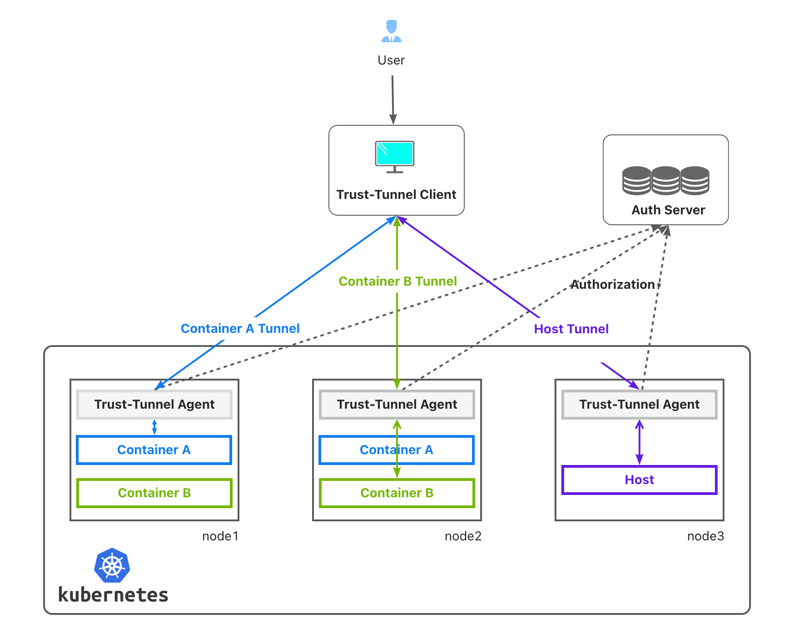

<p align="center">
  
</p>

# Trust-Tunnel: Secure Access to Remote Containers & Hosts

Trust-Tunnel is a powerful tool designed to create secure tunnels into remote **containers and physical hosts**.
Using Trust-Tunnel, users can easily access remote resources without having to worry about SSH passwords.
You can manage access permissions by using a **custom permission system** to manage user's permissions to remote resources.
The most important is that all the commands executed in the remote resources will run in a **sandbox environment** to prevent any potential security risks.

## Architecture Overview
<p align="center">
  
</p>

Trust-Tunnel consists of three main components:

- **Trust-Tunnel Agent**: Runs on each node and facilitates secure connections.
- **Trust-Tunnel Client**: Used by end-users to connect to the agent.
- **Auth Server**: Manages user permissions for accessing remote resources.

## Quick Start

### Prerequisites

- Linux
- Docker
- Go (1.21+)

### Build
  ```
  make images && make trust-tunnel-client
  ```

### Testing

After building, test Trust-Tunnel on Linux with:
  ```
  cd e2e && go test -v .
  ```

### Installation
#### Trust-Tunnel Agent
Install with Helm:
  ```
  helm install trust-tunnel-agent ./charts/trust-tunnel-agent
  ```

### Usage
#### Remote Physical Host
Execute a command:
  ```
  ./out/trust-tunnel-client -o $HOST_IP sh -c "pwd"
  # $HOST_IP is the remote host ip
  # replace 'pwd' with any command you want to execute
  ```

Log in interactively:
  ```
  ./out/trust-tunnel-client -it -o $HOST_IP sh -c "/bin/bash"
  # set -it flags to be true means you can use the terminal to interact with the remote host
  
  ```
#### Remote Container

Execute a command:
  ```
  ./out/trust-tunnel-client -o $HOST_IP  --type container --cid $cid sh -c "pwd"
  ```
Log in interactively:
  ```
  ./out/trust-tunnel-client -it -o $HOST_IP --type container --cid $cid sh -c "/bin/bash"
  ```

## Contact Us
- [xiaolin-lj](https://github.com/xiaolin-lj)

## Contributors
- [xiaolin-lj](https://github.com/xiaolin-lj)


