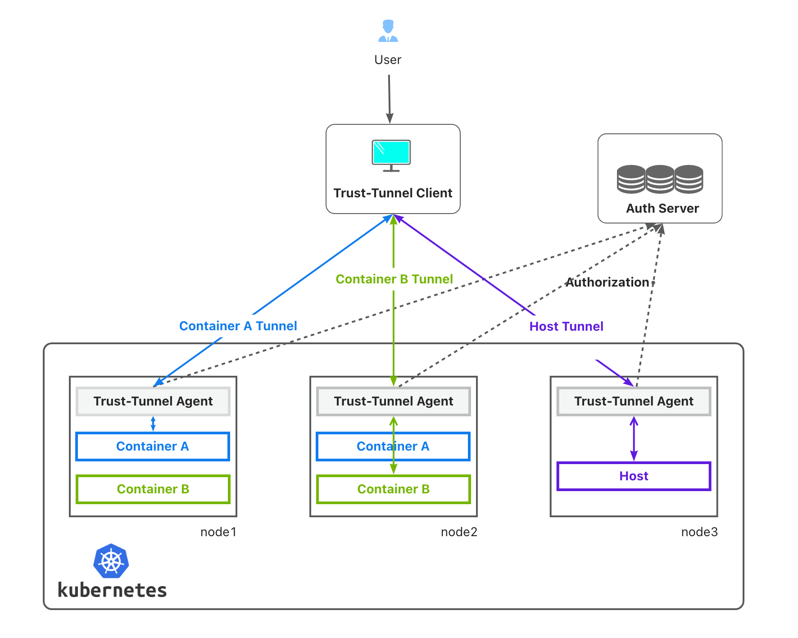

<p align="center">
  
</p>

<h1 align="center">Trust-Tunnel</h1>

<p align="center">
  <strong>Secure Access to Remote Containers & Hosts</strong>
</p>

<p align="center">
  <a href="https://github.com/antgroup/trust-tunnel/blob/main/LICENSE">
    
  </a>
  <a href="https://golang.org/dl/">
    
  </a>
  <a href="https://github.com/antgroup/trust-tunnel/releases">
    
  </a>
</p>

---

## Overview

Trust-Tunnel is a powerful tool designed to create secure tunnels into remote **containers and physical hosts**. It enables users to:

- **Seamless Access**: Access remote resources without managing SSH passwords
- **Permission Control**: Manage access permissions via a custom permission system
- **Sandbox Execution**: Execute commands in isolated sandbox environments to prevent security risks
- **Multi-Runtime Support**: Support both Docker and Containerd runtimes

## Architecture

<p align="center">
  
</p>

Trust-Tunnel consists of three main components:

| Component | Description |
|-----------|-------------|
| **Trust-Tunnel Agent** | Runs on each node and facilitates secure connections |
| **Trust-Tunnel Client** | CLI tool used by end-users to connect to the agent |
| **Auth Server** | Manages user permissions for accessing remote resources (optional) |

## Features

- 🔐 **TLS/NTLS Support**: Secure communication with standard TLS or Chinese national cryptography (SM2/SM3/SM4)
- 🐳 **Multi-Container Runtime**: Support Docker and Containerd
- 📦 **Sidecar Mode**: Execute commands in sandbox containers with resource limits
- 🔑 **Pluggable Authentication**: Extensible authentication interface
- 📊 **Prometheus Metrics**: Built-in monitoring support
- 📝 **Audit Logging**: Complete operation audit trail

## Quick Start

### Prerequisites

- Linux
- Docker or Containerd
- Go 1.21+

### Build from Source

```bash
# Build all images and client binary
make images && make trust-tunnel-client
```

### Run Tests

```bash
cd e2e && go test -v .
```

## Installation

### Kubernetes (Recommended)

Install with Helm:

```bash
helm install trust-tunnel-agent ./charts/trust-tunnel-agent
```

The Agent will be deployed as a DaemonSet, running one instance per node.

### Manual Installation

Build and run the Agent binary directly:

```bash
make trust-tunnel-agent
./out/trust-tunnel-agent --config config/config.toml
```

## Usage

### Client CLI Options

| Flag | Description |
|------|-------------|
| `-o, --host` | Target host IP address |
| `-it` | Interactive TTY mode |
| `--type` | Connection type: `host` or `container` |
| `--cid` | Container ID (required when type is `container`) |
| `--clean` | Enable sandbox mode (default: true) |
| `--cpu` | CPU limit for sandbox (e.g., `0.5`) |
| `--memory` | Memory limit for sandbox (e.g., `512M`) |

### Remote Physical Host

Execute a command:

```bash
./out/trust-tunnel-client -o $HOST_IP sh -c "pwd"
```

Interactive login:

```bash
./out/trust-tunnel-client -it -o $HOST_IP sh -c "/bin/bash"
```

### Remote Container

Execute a command:

```bash
./out/trust-tunnel-client -o $HOST_IP --type container --cid $CONTAINER_ID sh -c "pwd"
```

Interactive login:

```bash
./out/trust-tunnel-client -it -o $HOST_IP --type container --cid $CONTAINER_ID sh -c "/bin/bash"
```

### With Resource Limits (Sandbox Mode)

```bash
./out/trust-tunnel-client -o $HOST_IP --clean --cpu 0.5 --memory 512M sh -c "ls /"
```

## Configuration

The Agent is configured via a TOML file. See [`config/config.toml`](config/config.toml) for a complete example.

```toml
# Server configuration
host = "0.0.0.0"
port = "5006"

# Session configuration
[session_config]
phys_tunnel = "nsenter"  # Physical host tunnel method: nsenter or sshd

# Container runtime configuration
[container_config]
endpoint = "unix:///var/run-mount/docker.sock"
container_runtime = "docker"  # docker or containerd

# Sidecar configuration
[sidecar_config]
image = "trust-tunnel-sidecar:latest"
limit = 150  # Maximum sidecar containers per node
```

## Execution Modes

### Clean Mode (Sandbox)

Commands are executed in an isolated environment:

- **Container**: Creates a Sidecar container sharing the target container's namespaces
- **Physical Host**: Uses `nsenter` to enter host namespaces

### Non-Clean Mode (Direct)

Commands are executed directly:

- **Container**: Uses `docker exec` directly
- **Physical Host**: Uses SSH connection

## Security

- **Sandbox Isolation**: Sidecar containers provide command execution isolation
- **Resource Limits**: CPU and memory constraints prevent resource abuse
- **Permission Verification**: Pluggable authentication system
- **Audit Trail**: All operations are logged for auditing
- **Encrypted Communication**: TLS or NTLS (Chinese national cryptography)

## Contributing

We welcome contributions! Please feel free to submit a Pull Request.

1. Fork the repository
2. Create your feature branch (`git checkout -b feature/amazing-feature`)
3. Commit your changes (`git commit -m 'Add some amazing feature'`)
4. Push to the branch (`git push origin feature/amazing-feature`)
5. Open a Pull Request

## License

This project is licensed under the Apache 2.0 License - see the [LICENSE](LICENSE) file for details.

## Maintainers

- [xiaolin-lj](https://github.com/xiaolin-lj)

## Star History

[](https://www.star-history.com/#antgroup/trust-tunnel&Date)